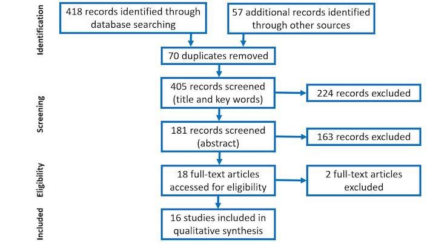
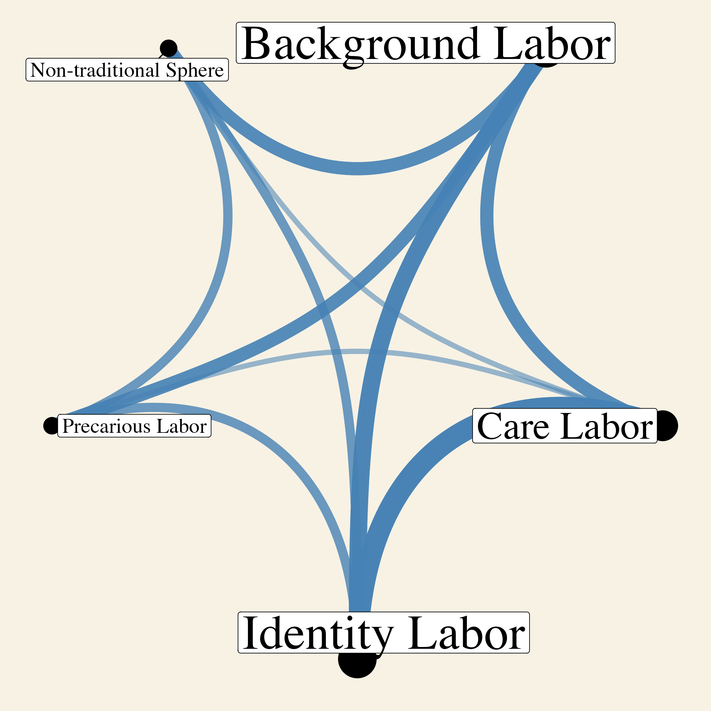

```{r setup, include=FALSE}
usethis::use_git_ignore(c("*.csv", "*.rds"))
options(htmltools.dir.version = FALSE)

library(knitr)
library(tidyverse)
library(xaringan)
library(fontawesome)
```

class: inverse, center, middle

# `r fa("fas fa-images", fill = "#fff")`

**View the slides:** 

[bretsw.com/aect22-invisible-labor](https://bretsw.com/aect22-invisible-labor)

---

class: inverse, center, middle

# `r fa("far fa-compass", fill = "#fff")` <br><br> Professional Learning

---

# `r fa("far fa-compass", fill = "#fff")` Professional Development

```{r, out.width = "600px", echo = FALSE, fig.align = "center"}

```

---

# `r fa("far fa-compass", fill = "#fff")` Informal Learning

```{r, out.width = "600px", echo = FALSE, fig.align = "center"}

```

---

class: inverse, center, middle

# `r fa("fas fa-comments", fill = "#fff")` <br><br> Informal Learning: Invisible?

---

# `r fa("far fa-compass", fill = "#fff")` Invisible Labor

```{r, out.width = "600px", echo = FALSE, fig.align = "center"}

```

--

**Definition:** Invisible labor is...

---

class: inverse, center, middle

# `r fa("fas fa-book-open", fill = "#fff")` <br><br> Method

---

# `r fa("fas fa-book-open", fill = "#fff")` Systematic Literature Review

### System ~ Preparation Process

```{r, out.width = "720px", echo = FALSE, fig.align = "center"}

```

---

# `r fa("fas fa-book-open", fill = "#fff")` Systematic Literature Review

### System ~ Preparation Process: PRISMA standards

```{r, out.width = "720px", echo = FALSE, fig.align = "center"}

```

---

class: inverse, center, middle

# `r fa("fas fa-binoculars", fill = "#fff")` <br><br> Findings

---

# `r fa("fas fa-book-open", fill = "#fff")` Overview of Articles

--

- Year:

--

- Country:

--

- Level:

--

- Methodology: 

---

# `r fa("fas fa-book-open", fill = "#fff")` Examples of Invisibility


---

# `r fa("fas fa-network-wired", fill = "#fff")` Intersections of Invisibility

```{r, out.width = "540px", echo = FALSE, fig.align = "center"}

```

---

# `r fa("fas fa-network-wired", fill = "#fff")` Invisible Labor Framework

```{r, out.width = "240px", echo = FALSE, fig.align = "center"}

```

--

- **Background Labor:** How might educators’ efforts be overlooked? 

--

- **Care Labor:** How might the emotional costs of educators’ efforts be dismissed or trivialized? 

--

- **Identity Labor:** How might some educators’ efforts be disproportionately burdensome? 

--

- **Precarious Labor:** How might educators’ efforts carry risk? 

--

- **Labor in a Non-Traditional Space:** How might educators’ efforts occur where they never have before? 

---

class: inverse, center, middle

# `r fa("fas fa-thumbtack", fill = "#fff")` Significance

---

class: inverse, center, middle

# `r fa("fas fa-question", fill = "#fff")` <br><br> Questions

**What would you like to know more about?**

<hr>

**Bret Staudt Willet** <br> `r fa("envelope", fill = "#fff")` [bret.staudtwillet@fsu.edu](mailto:bret.staudtwillet@fsu.edu) | `r fa("twitter", fill = "#fff")` [@bretsw](https://twitter.com/bretsw) <br> `r fa("globe", fill = "#fff")` [bretsw.com](https://bretsw.com) | `r fa("fab fa-github", fill = "#fff")` [GitHub](https://github.com/bretsw/)

<br>

**Dan He** <br>`r fa("envelope", fill = "#fff")` [dhe@fsu.edu](mailto:dhe@fsu.edu) | `r fa("twitter", fill = "#fff")` [@Dan__He](https://twitter.com/Dan__He)