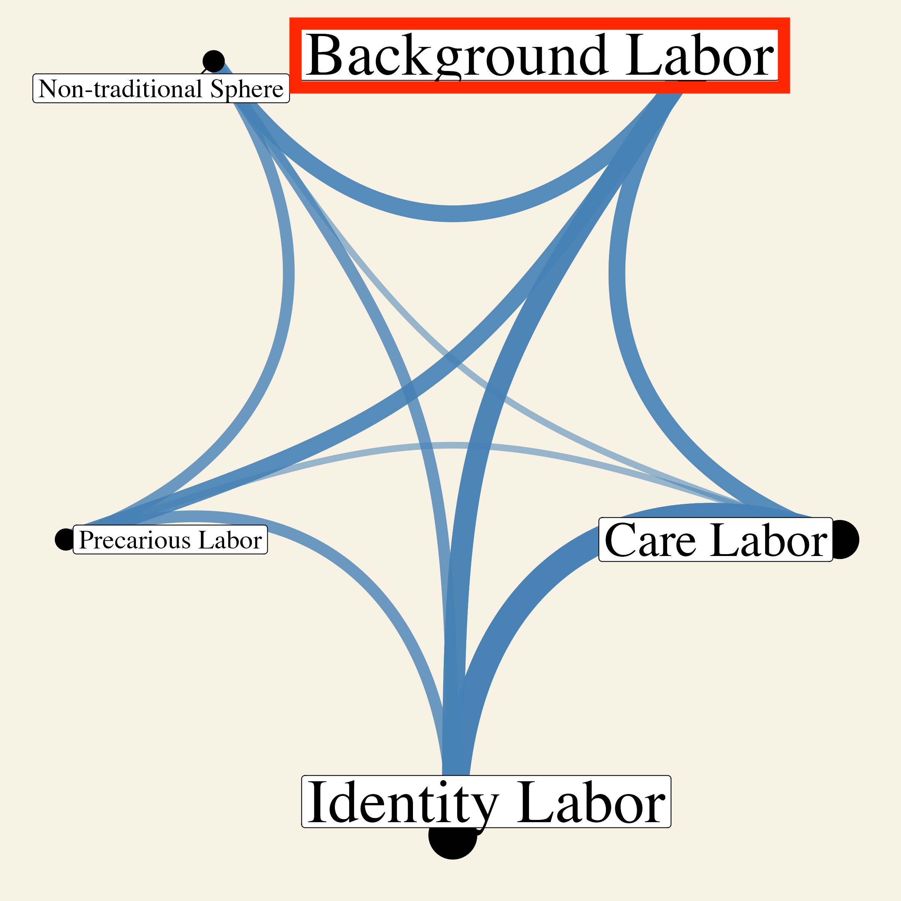
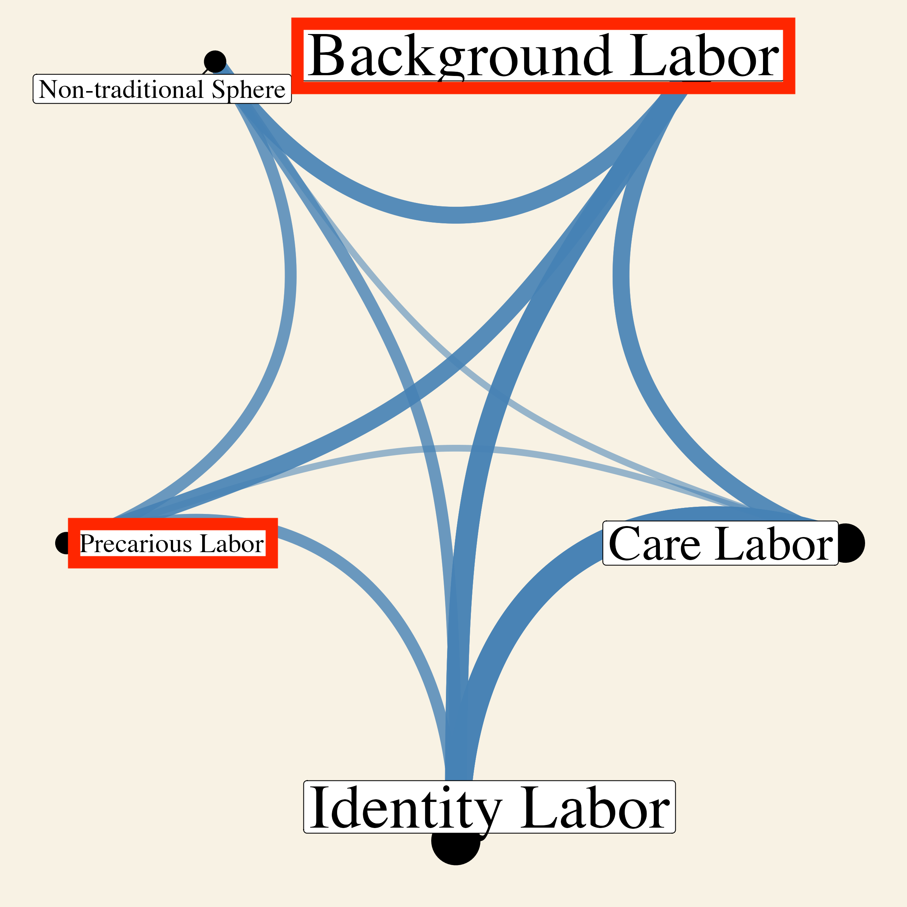
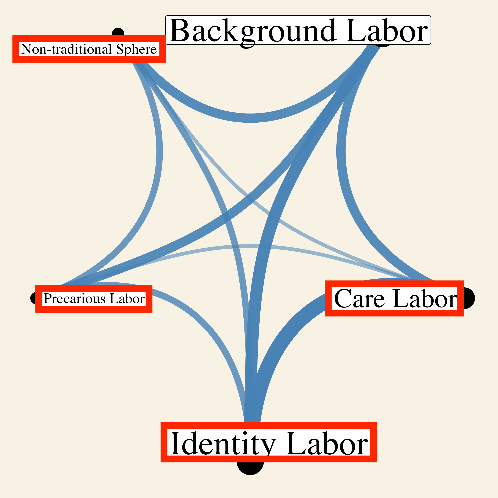

```{r setup, include=FALSE}
usethis::use_git_ignore(c("*.csv", "*.rds"))
options(htmltools.dir.version = FALSE)

library(knitr)
library(tidyverse)
library(xaringan)
library(fontawesome)
```

class: inverse, center, middle

# `r fa("fas fa-images", fill = "#fff")`

**View the slides:** 

[bretsw.com/aect22-invisible-labor](https://bretsw.com/aect22-invisible-labor)

---

class: inverse, center, middle

# `r fa("far fa-compass", fill = "#fff")` <br><br> Background

---

# `r fa("far fa-compass", fill = "#fff")` Professional Development

```{r, out.width = "600px", echo = FALSE, fig.align = "center"}
include_graphics("img/workshop.jpg")
```

--

Working in education requires many skills and keeping up with rapid changes

--

necessitating ongoing professional development

---

# `r fa("far fa-compass", fill = "#fff")` Informal Learning

```{r, out.width = "600px", echo = FALSE, fig.align = "center"}
include_graphics("img/digging.jpg")
```

Educators often have to figure things out on their own

--

through various means of informal learning

---

class: inverse, center, middle

# `r fa("fas fa-pause", fill = "#fff")` <br><br> Is informal learning <br> invisible labor?

---

# `r fa("far fa-compass", fill = "#fff")` Invisible Labor

```{r, out.width = "600px", echo = FALSE, fig.align = "center"}
include_graphics("img/invisible.jpg")
```

--

### Definitions:

--

- **Labor** is effort- or process-oriented understanding of professional activity.

--

- **Invisibility** is the processes through which professional activities might be overlooked, ignored, or devalued.

---

class: inverse, center, middle

# `r fa("fas fa-book-open", fill = "#fff")` <br><br> Method

---

# `r fa("fas fa-book-open", fill = "#fff")` Purpose

```{r, out.width = "240px", echo = FALSE, fig.align = "center"}

```

To understand educators' invisible labor, we searched 10 databases for:

--

- Peer-reviewed academic journal articles

--

- Written in English

--

- Years **2011–2021**

--

- **Keywords in Abstract:** and with at least one of the words education, teacher, educator, instructor, social media, professional development, professional learning, **or** informal learning

--

- **Keywords in Full Text:** invisible work, invisible labor, digital labor, hidden work, hidden labor, shadow work, shadow labor, shared economy, gift economy, invisible economy, **or** hidden economy

---

# `r fa("fas fa-book-open", fill = "#fff")` Systematic Literature Review

```{r, out.width = "100%", echo = FALSE, fig.align = "center"}
include_graphics("img/fig1-PRISMA-flow-chart.jpg")
```

---

# `r fa("fas fa-book-open", fill = "#fff")` Systematic Literature Review

**1. Identification:**

--

  - **475 records** (418 from databases, 51 from table of contents, 6 from snowball)
  
  - 70 duplicates removed

--

**2. Screening:**

--

  - **405 records** screened by Title and Keywords
  
  - 224 records excluded
  
--
  
  - **181 records** screened by Abstract
  
  - 163 records excluded
  
--

**3. Eligibility**

--

  - **18 full-text articles** accessed for eligibility
  
  - 2 full-text articles excluded

---

class: inverse, center, middle

# `r fa("fas fa-network-wired", fill = "#fff")` <br><br> Findings

---

# `r fa("fas fa-network-wired", fill = "#fff")` Overview of Articles (n=16)

```{r, out.width = "480px", echo = FALSE, fig.align = "center"}

```

--

- **Publication Year:** 2 in 2011, 14 in 2017-2021

--

- **Research Methodology:** 11 qualitative, 3 quantitative, 2 mixed

--

- **Country:** 10 US, 2 UK, 1 each from Australia, Canada, Finland, Hong Kong, and Sweden

--

- **Type of Educators:** 11 higher ed faculty, 6 K-12 teachers, 1 pre-service teachers, 1 higher ed staff

---

# `r fa("fas fa-network-wired", fill = "#fff")` Intersections of Invisibility

```{r, out.width = "540px", echo = FALSE, fig.align = "center"}
include_graphics("img/fig2-articles-intersections-plot.png")
```

---

# `r fa("fas fa-network-wired", fill = "#fff")` Examples of Invisibility

*Administrative Intensity and Faculty Job Stress* **(Taggart, 2021)**

```{r, out.width = "320px", echo = FALSE, fig.align = "center"}

```

--

- A study about the relationship between faculty members’ increased administrative responsibilities and job stress

--

- These **administrative responsibilities** were invisible because they were **background labor**, overlooked because not part of the main responsibilities of research and teaching

---

# `r fa("fas fa-network-wired", fill = "#fff")` Examples of Invisibility

*Invisible Labor, Visible Change: Non-Tenure-Track Faculty Agency in a Research University* **(Drake et al., 2019)**

```{r, out.width = "320px", echo = FALSE, fig.align = "center"}

```

--

- A study about how non-tenure-track faculty members perceive and operationalize their agency in a higher education research institution

--

- The faculty members' **non-tenure-track status** meant **precarious labor** intersecting with background labor

---

# `r fa("fas fa-network-wired", fill = "#fff")` Examples of Invisibility

*The Invisible Labor of Social Media Pedagogy: A Case Study of #TeamRhetoric Community-Building on Twitter* **(Vie, 2021)**

```{r, out.width = "320px", echo = FALSE, fig.align = "center"}

```

--

- A study about social media use in a graduate-level rhetoric and composition course

--

- Having grad students use social media for class created invisible labor for academics outside the class to by asking them to comment, reply, and provide advice

---

class: inverse, center, middle

# `r fa("fas fa-pause", fill = "#fff")` <br><br> Invisible Labor Reflection

---

# `r fa("fas fa-pause", fill = "#fff")` Invisible Labor Reflection

```{r, out.width = "240px", echo = FALSE, fig.align = "center"}
include_graphics("img/fig2-articles-intersections-plot.png")
```

--

- **Background Labor:** How might educators’ efforts be overlooked? 

--

- **Care Labor:** How might the emotional costs of educators’ efforts be dismissed or trivialized? 

--

- **Identity Labor:** How might some educators’ efforts be disproportionately burdensome? 

--

- **Precarious Labor:** How might educators’ efforts carry risk? 

--

- **Labor in a Non-Traditional Space:** How might educators’ efforts occur where they never have before? 

---

class: inverse, center, middle

# `r fa("fas fa-binoculars", fill = "#fff")` Significance

---

# `r fa("fas fa-binoculars", fill = "#fff")` Significance

```{r, out.width = "540px", echo = FALSE, fig.align = "center"}
include_graphics("img/invisible.jpg")
```

### Invisible Labor framework

--

- **For practitioners:** Engage in self-reflection

--

- **For education leaders:** Make the invisible visible

--

- **For researchers:** Interrogate the literature

---

class: inverse, center, middle

# `r fa("fas fa-question", fill = "#fff")` <br><br> Questions

**What would you like to know more about?**

<hr>

**Bret Staudt Willet** <br> `r fa("envelope", fill = "#fff")` [bret.staudtwillet@fsu.edu](mailto:bret.staudtwillet@fsu.edu) | `r fa("twitter", fill = "#fff")` [@bretsw](https://twitter.com/bretsw) <br> `r fa("globe", fill = "#fff")` [bretsw.com](https://bretsw.com) | `r fa("fab fa-github", fill = "#fff")` [GitHub](https://github.com/bretsw/)

<br>

**Dan He** <br>`r fa("envelope", fill = "#fff")` [dhe@fsu.edu](mailto:dhe@fsu.edu) | `r fa("twitter", fill = "#fff")` [@Dan__He](https://twitter.com/Dan__He)